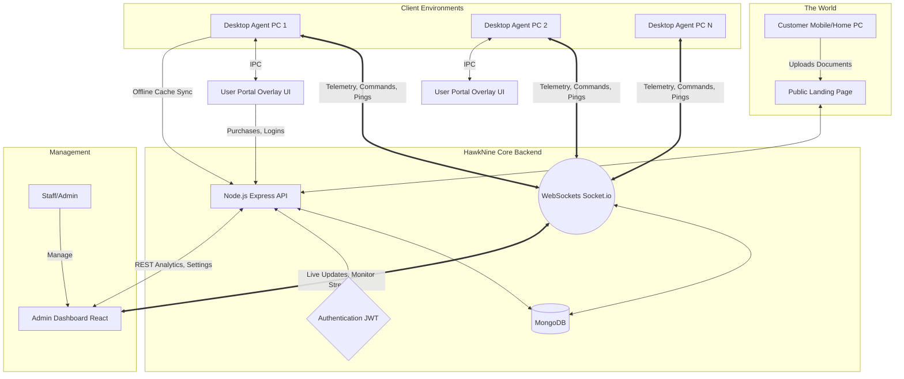
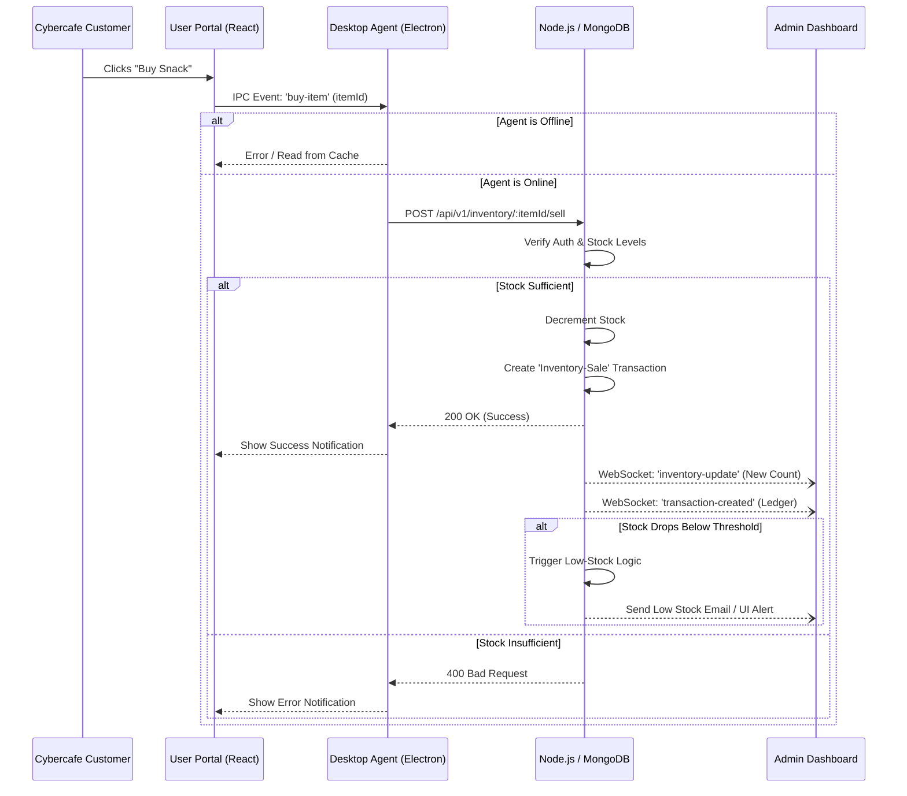
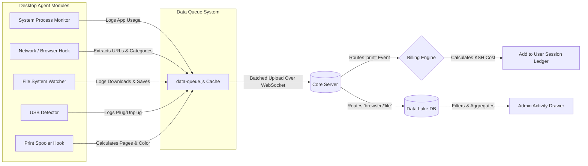
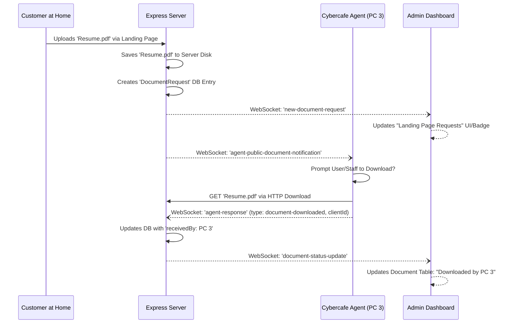

# HawkNine Architecture & System Flow

The visual diagrams below illustrate the architecture, telemetry flow, and transaction lifecycles for the HawkNine platform.

## 1. High-Level Core Architecture



## 2. Inventory Purchase Flow Lifecycle



## 3. Print Interception & Activity Telemetry Engine



## 4. Public Document Handling & Remote Downloads



## 5. Remote Screenshot Flow

```mermaid
flowchart TD
    Staff[Admin] -->|Clicks 'Screenshot'| AD[Admin Dashboard]
    AD -->|POST /api/v1/admin/computers/:id/screenshot| API[Node.js API]
    API -->|Identify Target Socket Connection| Router{Socket Router}
    Router -->|socket.to(clientId).emit('agent-command')| TargetAgent[Specific Desktop Agent]
    TargetAgent -->|Invokes screenshot-desktop package| Screen(Capture OS Display)
    Screen -->|Encodes to Base64| TargetAgent
    TargetAgent -->|socket.emit('agent-response', base64)| Router
    Router -->|io.emit('agent-screenshot')| AD
    AD -->|Renders Image| Staff 
```
